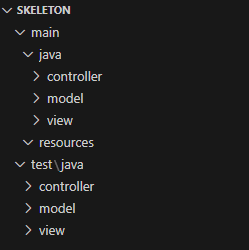

# Proyecto Capston: Game Of Life - Por Juan Ignacio Mena (JIM)

# Declaración de intenciones

 *Si este proyecto no es el mejor de entre todos, habré fracasado.*

El proyecto Capston representa una parte importante de mi nota en la materia de Programación 1. Por eso mismo debe ser afrontado como lo que es, un desafío. Pero no por el hecho de que vaya a ser un desafío debo de temerle, sólo debo respetarlo. Por eso me tomo la molestia de escribir esta **declaración de intenciones**, en este plantearé lo que busco hacer en el proyecto y cómo hacerlo. Documentando mi avance como es debido de la manera más profesional posible.

 Mi idea es aplicarle, además de todos los criterios de evaluación que son requeridos, testing, para manejar la implementación de las funcionalidades y conceptos de arquitectura, en este caso usando la arquitectura **MVC**.



NOTA: La carpeta `SKELETON` es equivalente a `src`

Esa es la estructura ideal que tendrá mi GOL, un *golazo.*

---

# Desglose general de GOL con pensamiento computacional:

Habiendo visto el **pensamiento computacional**, creo que lo mejor que puedo hacer primero es aplicarlo en este trabajo para poner a prueba lo aprendido.

## Descomposición de GOL:

NOTA: Los nombres de variables con **“?”** hace referencia a que son sólo nombres posibles.

### Inicialización de la cuadricula:

- Debo considerar parámetros de entrada como son: ancho (`wdth`?), alto(`height`?), población(`population`?) y tipo de vecindario(**`neighborhood`**?).
- Puedo usar la cuadricula como una matriz `Integer[][]` para representarla como en [https://conwaylife.com/](https://conwaylife.com/) que muestra las cuadriculas las cuales tuvieron vida.
- Validar parámetros de entrada y manejar los posibles errores.
- Las 4 reglas de evolución son:
    - Subpoblación.
    - Superpoblación.
    - Supervivencia.
    - Nacimiento.
- Basado en las reglas, pasar a la siguiente generación.
- Manejar las pausas entre generaciones (`screens`?) para mostrarlas paulatinamente.
- Terminar cuando se alcance el número límite de generaciones (`genLimit`?).

## Abstracción de GOL:

### Tablero:

- Las cuadrículas serán representadas con valores numéricos
    - `0`: Célula muerta.
    - `1`: Célula viva.
- El estado del tablero(`grid`?) será almacenado en una matriz `Integer[][]`? y cada celda será evaluada en función a sus vecinos.

### Vecindarios:

- Cada vecindario cambia las reglas de como se contabilizan los vecinos en GOL.

NOTA: Sería interesante incorporar más de un vecindario al programa

## Expresión algorítmica de GOL:

```

FUNCION initializeGrid(width, height, population[]):
CREAR matriz grid[width][height] con valores 0

  PARA i DESDE 0 HASTA population.LENGTH:
      ASIGNAR valores de population[i] en grid[i].
      SI el tamaño de population[i] no coincide con width.length OR height.length:
            RETORNAR ERROR ("Población inicial inválida")
RETORNAR grid
```

```
FUNCION countAliveNeighbors(grid, x, y, neighborhood):
    INICIALIZAR contador = 0
    
    PARA cada neighborhood en grid(x, y):
        nx = x
        ny = y
        count += grid[nx][ny]
    
    RETORNAR contador
```

```
FUNCION evolve(grid, neighborhood):
    CREAR matriz nextGeneration del mismo tamaño que grid
    
    PARA cada celda (x, y) en grid:
        aliveNeighbors = countAliveNeighbors(grid, x, y, neighborhood)
        
        SI grid[x][y] == 1:
            SI aliveNeighbors < 2 O aliveNeighbors > 3:
                nextGeneration[x][y] = false  
            SI NO:
                nextGeneration[x][y] = true  
        SI NO:
                nextGeneration[x][y] = grid[x][y]  
    
    RETORNAR nextGeneration
```

## Evaluación de GOL:

- Usando JUinit la lógica será puesta a prueba en cada feature agregada

# Documentación de Game of Life - By JIM

## Líneas generales

El proyecto es una simulación del “Juego de la Vida” de Conway. Implementada utilizando `JavaFX` como interfaz gráfica.

### Dependencias

El proyecto utiliza `Maven` para la gestión de dependencias (JavaFX en este caso)

### Ejecución del proyecto

Con el siguiente comando de Maven el proyecto es ejecutado:

```bs
mvn javafx:run
```

Igualmente me gustaría que mi versión final sea portable. *No le tome mucho cariño al comando.*

### Estructura

`gol`: contiene las clases principales del proyecto

`App`: es la clase principal o *main* que extiende de `Aplication` (clase de JavaFX) y configura la ventana de la aplicación (`GameOfLifeView.fxml`)

`GameOfLifeController`: es el controlador que maneja la lógica de la vista e interactua con el modelo.

`GameOfLifeModel`: contiene la lógica del juego (actualización del grid, conteo de vecinos, randomizar el grid…)

`GameOfLifeView`: se define en formato `fxml` la interfaz de usuario con JavaFX.


La carpeta `java` en `test` es para realizar pruebas unitarias a implementar para depurar más facilmente uno que otro bug que tiene mi GOL (debí implementarlas primero aplicando TDD).

## GameOfLifeModel.java

La clase GameOfLifeModel es declarada. Dentro de esta se declaran 2 variables y 3 matrices

```java
private final int width;
private final int height;
private boolean[][] grid;
private boolean[][] nextGrid;
private boolean[][] neighborhoodPattern = new boolean[3][3]
```

Todas tienen un nombre que se explica bien por si mismo, aunque quizá `neighborhoodPattern` puede ser confuso/extraño. Esta variable es la que se utiliza para definir el patrón de vecindario que será contabilizado.

Se define el constructor GameOfLifeModel. Que recibe como parametro el alto y ancho e inicializa el `grid` y `newGrid` con los valores que recibe. También las las propiedades widht y heigth del objeto toman su respectivo valor.

Se declara setNeighborhoodPatern que toma un patrón de vecindario como parametro y le asigna su valor a la propiedad `neighborhoodPattern` .

Se declara el metodo randomize. Este itera sobre cada celda de la grid y le asigna un valor aleatorio 1 de cada 5 veces.

Se define el método updateGrid que actualiza el estado de la cuadrícula según las reglas de GOL. Itera sobre grid, cuenta los vecinos vivos según las reglas de `countCustomNeighbors` y actualiza `nextGrid`. Finalmente, intercambia las referencias entre `grid` y `nextGrid` para que `grid` contenga el nuevo estado.

Se declara el metodo countCustomNeigbors. Que se encarga de contar el numero de vecinos de una celula con el patrón que ingrese el usuario. Se inicializa un contador, se declaran las direcciones en la matriz `directions` con las posiciones al rededor de cada célula. Se itera sobre cada una de las direcciones. Se calculan las coordenadas de los vecinos `nx` y `ny` (n de neighbor) sumando las coordenadas de la celula actual. Se verifican que las coordenads del vecino esten dentro de los limites de la cuadricula para evitar errores, que la celula vecina esté viva y que el patron de vecindad permita contar ese vecino. Si todas las normas se cumplen, se incrementa el contador el cual es retornado. 

Se declara el metodo getCell que devuelve el estado de una celula en coordenadas recibidas por parametros.

Se declara el método setCell, que establece el estado de una celula en en coordenadas escpecificas recibidas por parametros. Tambien recibe el estado a modificar.

Se declara el metodo clearGrid que limpia la grid iterando sobre cada celula matandola.

## GameOfLifeController.java

Primero se importan todas las clases necesarias de JavaFX para la animación, eventos y graficos.

Se declara la clase GameOfLifeController. Dentro de esta se tienen diversas variables. De entre estas, destaco los elementos `@XFML`. `@XFML` es una notación que vincula a los elementos definidos en la vista (`GameOfLifeView`) con los del controlador y permite que JavaFX acceda a ellos y los manipule. Además, destaco a `timeline` y `game` que son la línea de tiempo de la animacion de JavaFX y el modelo del juego respectivamente.

Se declara el método initialize que se llama despues de que se cargue el archivo FXML configurando el juego, el manejador de clicks, la cuadricula del manejador de vecinos y modifica propiedades de scrollPane (elemento utilizado para renderizar la grid).

Se declara el metodo setupNeighborhoodGrid que configura la grid de configuración de vecindad.

Se declara el método applyGenerationLimit que se llama cuando se aplica un nuevo limite de generaciones. Actualiza `maxGeneration` y reinica el juego.

Se declara el metodo applySpeed. Se llama cuando el usuario aplica una nueva velocidad de actualización entre generaciones. Reinicia el juego y configura la linea de tiempo.

se declara el metodo applyGridSize que se llama cuando el usuario modifica el tamaño del grid.

Se declara el metodo setupGame que inicializa el modelo del juego, configura el canvas y dibuja la grid inicial.

Se declara el método setupTimeline que configura la línea de tiempo para actualizar la cuadrícula en cada intervalo de tiempo especificado por `speed`.

Se declara el metodo startGame que se llama cuando el usuario inicia el juego. Reinicia la generación actual, actualiza la etiqueta de generación y comienza la línea de tiempo.

Se declara el metodo stopGame que detiene el juego.

Se declara el metodo resetGame que reinicia el juego limpiando la grid, la generacion actual, detiene el juego y dibuja la nueva  grid.

Se declara el el método randomize que se llama cuando el usuario aleatoriza la cuadrícula. Reinicia la generación actual, aleatoriza la grid y la dibuja.

Se declara el metodo newGeneration, que que actualiza la grid a la siguiente generacion y verifica el limite de generaciones.

Se declara el método updateGenerationLabel que actualiza la etiqueta de generación con la generación actual.

Se declara el metodo setupCellClickHandler que configura el manejo de clicks en el canvas.

Se declara el metodo handleCellClick. Se encarga de manejar los clicks en el canvas cambiando el estado de las celulas clickeadas y dibuja la cuadricula actualizada.

Se declara el método draw, que dibuja la grid en el canvas iterando sobre cada celula y dibuja el color correspondiente segun su estado mediante un ternario

## App.java

Primero, como en el controlador, se importan las clases ncesarias de JavaFX para la aplicación y la configuracion de la ventana principal (`Stage`).

Destaco tambien la importacion de `java.io.IOException` para el manejo de excepciones de entrada y/o salida.

Se declara la clase App que exitiende de Application (clase base para aplicaciones JavaFX). Esta sobreescribe el metodo start, se crea una instancia de FXMLLoader en la variable `loader` y carga el archivo xfml en el path indicado. Se carga este archivo en `root` que es una variable de tipo `BorderPane` lo cual implica que organiza los nodos (objetos que pueden ser agregados a la escena grafica) en 5 partes top, bottom, left, right y center. Se crea una nueva escena con root, siendo la escena el contenedor principal para todos los nodos de la interfaz de usuario. La escena se establece en `primaryStage`, la cual es la ventana de la aplicación. Se define el titulo y finalmente se muestra la ventana.

El metodo main llama al metodo launch de `Appliacion` que inicializa la aplicación.

## GameOfLifeView.fxml

Se importan las clases necesarias. Luego, se declara un BorderPane como nodo root del diseño. Define losmbres XML para JavaFX y FXML y, por ultimo, especifica que el controlador `GameOfLifeController` manejará la logica. 

Se divide en 3 regiones; top, center y bottom. Dentro de cada una se encuentran los botones e inputs para el manejo del Game Of Life con sus respectivas `fx:id`s. 

# Conclusión del avance

Como usted ya sabe, quería que este trabajo sea el mejor. Y para esto debía llegar a este punto con el trabajo casi terminado. El area que mas rango de mejora tiene es el archivo `GameOfLifeController.java`. El código puede ser mucho más limpio ahí. Espero su feedback, tanto en código como documentación, para poder armar el mejor proyecto del semestre. *Hagamos un golazo.*